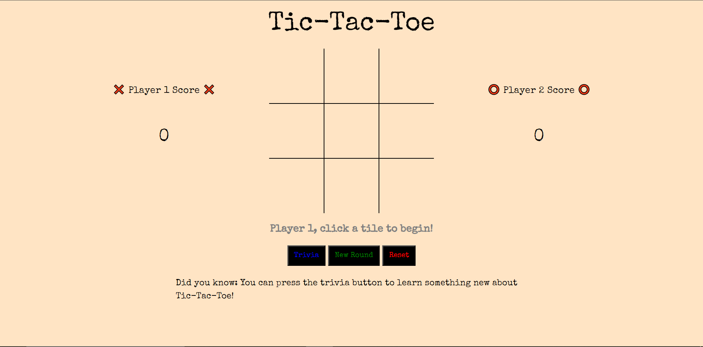
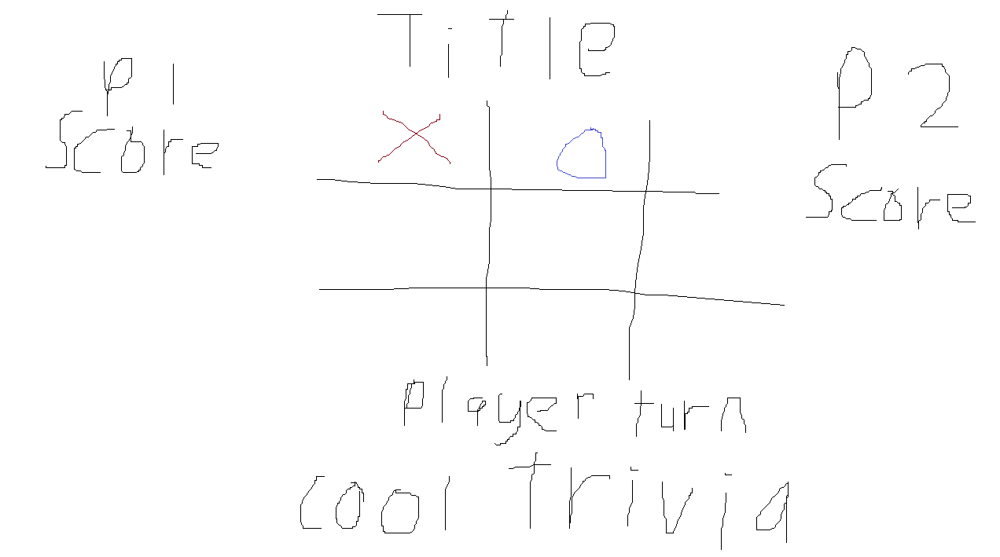

# ❌Tic Tac Toe ⭕
My first attempt at a functional browser-based Tic-Tac-Toe game.

Here's the [link](https://cobaltdingus.github.io/tictactoe/) to my project.

# Getting Started
Tic-Tac-Toe is meant to be played between two people. 

To begin, just click on any tile on the board to place a token. Player One (the 'X' token) goes first, followed by Player Two (the 'O' token). The game continues until one player fills three consecutive squares - horizontal, vertical, or diagonal - with their respective token, upon which they win the round. Alternatively, if all tiles are filled with no winner, the game ends in a draw.

# Planning

For my project, I wanted to keep things simple. My final design roughly resembles what I planned at a baseline. I intended to do more with the 'trivia' section, changing the background and adding images but that ended up being beyond my scope.

My process was to first build the basic game functions before designing any visuals. My main method for checking if a player had won was to make an array out of every column, row, and diagonal and check if every tile in the array had the same symbol.

After that, I had variables to check whether the game had finished or resulted in a tie. I hooked up the scores to the scoreboard and coded visual feedback for player actions/victories.

Finally, I made buttons to start a new round and reset the game. It later turned out that adding a trivia section wasn't too hard so I was able to 

### Technologies Used
* Languages: HTML, CSS, Javascript

### Attributions
* X icon - P.J. Inori (Noun Project)
* O icon - Thomas Le Bas (Noun Project)
* Favicon - Freepik (Flaticon)

# Bugs
None (so far)

# Lessons Learnt
* Web design is something I need to work on; my current knowledge is very limited
* Return values from functions are something I could utilize better
* I could work more on algorithms to find more efficient solutions for going over arrays

# Future Features
* Add animations for messages
* Add audio for actions + music
* Make better use of empty space
* Make site responsive
* Polish code further